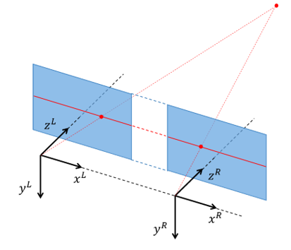

# Lab 7: Stereo processing
In this lab we will experiment with stereo processing.

Start by cloning this repository on your machine.
Then open the project.

The lab is carried out by following these steps:

1. [Get an overview](lab-guide/1-get-an-overview.md).
2. [Sparse stereo processing](lab-guide/2-sparse-stereo-processing.md).
3. [Dense stereo processing](lab-guide/3-dense-stereo-processing.md).

Please start the lab by going to the [first step](lab-guide/1-get-an-overview.md).

## Setup for Jetson (on the lab)
