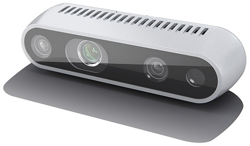

# Step 1: Get an overview
We will start by presenting an overview of the lab and the contents of this project.

## Stereo camera


In this lab we will experiment with stereo processing using the Intel RealSense D435 (shown above) which has 4 components:
  - 1 RGB colour rolling shutter camera (rightmost in the image)
  - 2 panchromatic cameras that are also sensitive in the invisible near-infrared (NIR) (leftmost & second from the right in the image).
    These cameras have a global shutter, which lets us avoid geometric distortions during movement.
  - 1 NIR laser projector (second from the left in the image).
    The laser lets us project patterns onto the scene, which is used to support stereo matching in difficult areas.

Today, we will mainly use the two panchromatic cameras, but we can choose to activate the projector if we want to. 
It will illuminate the scene with a dotted pattern.

The D435 is precalibrated, and it can provide us with rectified stereo images and the calibration parameters.

## Stereo dataset
If you do not have the RealSense D435 available, we have also provided a stereo interface to a freely available dataset.
The [Kitti Dataset](http://www.cvlibs.net/datasets/kitti/index.php) can  provide:
  - Raw (unsynced+unrectified) and processed (synced+rectified) grayscale stereo sequences (0.5 Megapixels, stored in png format)
  - Raw (unsynced+unrectified) and processed (synced+rectified) color stereo sequences (0.5 Megapixels, stored in png format)
  - Calibration data (stored as text file)

We will use the unrectified grayscale images from the dataset, and perform rectification using the provided calibration data.

### Download the Kitti data
If you want to use the dataset, let's start downloading the data right away!

Go to [http://www.cvlibs.net/datasets/kitti/raw_data.php](http://www.cvlibs.net/datasets/kitti/raw_data.php?type=campus) to find the different datasets. 
You will have to register in order to download data.
Select one of the categories and download a dataset.
You will see

> **Downloads:** `[unsynced+unrectified data] [synced+rectified data] [calibration]`

- Download `[unsynced+unrectified data]` and extract the files to some directory on your computer.
  - If you are short on disk space, you may delete the `oxts` and `velodyne_points` right away.
- Download `[calibration]` and extract the files to some directory on your computer.


The extracted data should look like this
```
Downloads
.
├── 2011_09_28
│   └── 2011_09_28_drive_0016_extract
│       ├── image_00
│       │   ├── data
│       │   └── timestamps.txt
│       ├── image_01
│       │   ├── data
│       │   └── timestamps.txt
│       ├── image_02
│       │   ├── data
│       │   └── timestamps.txt
│       ├── image_03
│       │   ├── data
│       │   └── timestamps.txt
│       ├── oxts
│       │   ├── data
│       │   ├── dataformat.txt
│       │   └── timestamps.txt
│       └── velodyne_points
│           ├── data
│           ├── timestamps_end.txt
│           ├── timestamps_start.txt
│           └── timestamps.txt
└── 2011_09_28_calib
    └── 2011_09_28
        ├── calib_cam_to_cam.txt
        ├── calib_imu_to_velo.txt
        └── calib_velo_to_cam.txt
```

In the lab, you must specify the directories containing data and calibration.
- The data directory is the one containing the `image_xx` folders, e.g. `/path/to/download/2011_09_28/2011_09_28_drive_0016_extract/`
- The calib directory is the one containing the `calib_cam_to_cam.txt` file, e.g. `/path/to/download/2011_09_28_calib/2011_09_28/`


## Lab overview
The main steps of today's lab are:

- Sparse stereo processing
  - Establish point correspondences based on keypoint descriptors
  - Detect and discard bad correspondences based on the epipolar geometry
  - For each good correspondence:
    - Determine the disparity
    - Compute the depth in meters
    - Compute the 3D point

- Dense stereo processing
   - Experiment with existing implementations to produce dense depth images

## Introduction to the project source files
We have chosen to distribute the code on the following modules:

- [**lab_stereo.py**](../lab_stereo.py)

  Contains the main loop of the program and all exercises.
  Please read quickly through the function `run_stereo_lab()` to get a feel of how the lab works.

- [**common_lab_utils.py**](../common_lab_utils.py)

  This module contains utility functions and classes that we will use both in the lab and in the solution.
  Please take a quick look through the code.

- [**visualisation.py**](../visualisation.py)  

  Contains functionality for visualising results in 2D and 3D.

- [**real_sense_stereo_camera.py**](../real_sense_stereo_camera.py)

  An interface to the RealSense camera so that we can stream stereo data from it.

- [**kitti_interface.py**](../kitti_interface.py)

  An interface to the Kitti dataset so that we play through a dataset like it was a stereo camera.

- [**stereo_calibration.py**](../stereo_calibration.py)

  Represents a calibrated stereo camera.

- [**solution_stereo.py**](../solution_stereo.py)

  This is our proposed solution to the lab.
  Please try to solve the lab with help from others instead of just jumping straight to the solution ;)

    
Please continue to the [next step](2-sparse-stereo-processing.md) to get started!

Good luck!
