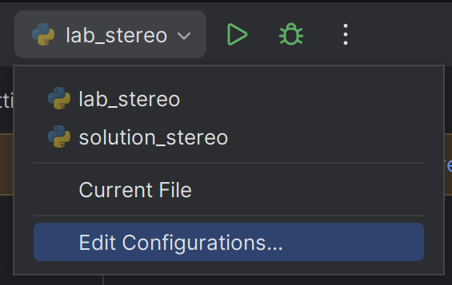

# Step 2: Sparse stereo processing
Now, let's do some stereo processing!

## 1. Choose stereo data source
You can choose which source to use in the bottom of [lab_stereo.py](../lab_stereo.py):

```python
def kitti():
    import sys
    
    # Read paths from the command line arguments.
    cam = KittiCamera(*sys.argv[1:3])
    
    calibration = StereoCalibration.from_kitti(cam)
    return cam, calibration


def realsense():
    cam = RealSenseStereoCamera()
    calibration = StereoCalibration.from_realsense(cam)
    return cam, calibration


if __name__ == "__main__":
    run_stereo_lab(*realsense())
```

If you want to use the Kitti dataset, change the last line to `run_stereo_lab(*kitti())` and provide the dataset paths on the command line.
In PyCharm, go to <kbd>Edit Configurations...</kbd> and enter the arguments in the field "Script parameters"



Alternatively, just hard code the paths instead.
```py
# Read paths from the command line arguments.
cam = KittiCamera("2011_09_28/2011_09_28_drive_0016_extract/", "2011_09_28_calib/2011_09_28/")
```

## 2. Improve point correspondences
Go to `SparseStereoMatcher._extract_good_matches()` in [lab_stereo.py](../lab_stereo.py).
Your task is to exploit what we know about the epipolar geometry to remove bad matches.
What "rules" must a match follow in order to be valid?
We should also remove matches that result in impossible disparities.

Hint: Use the fact that the images are rectified, and now follow the model of ideal stereo geometry.

## 3. Compute disparity
Go to `compute_disparities()` in [lab_stereo.py](../lab_stereo.py).
This function currently sets all disparities to 0.
Your task is to make it return the proper disparities instead.

Hint: See the lecture!

## 4. Compute depth
Go to `compute_depths()` in [lab_stereo.py](../lab_stereo.py).
This function should compute the depth in meters for each disparity value.
Currently, the depth is set to be equal to the disparity.
Your task is to compute the proper depth.

Hint: See the lecture!

## 5. Compute 3D points
Instead of computing the depth directly as we did above, we can use the **Q** matrix (from `StereoCalibration`) to compute the complete 3D point in the left camera coordinate system.
Go to `compute_3d_points()` in [lab_stereo.py](../lab_stereo.py).
Your task is to compute the 3D point for each point correspondence.

Hint: [points, disparity] and the 3D points are related by the homography **Q** (see the lectures).

Please continue to the [next step](3-dense-stereo-processing.md), where we explore dense stereo processing!
